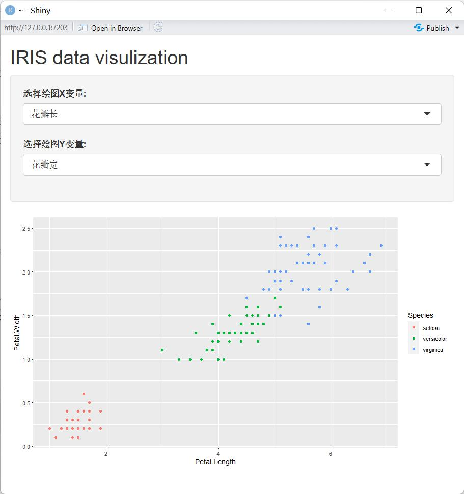
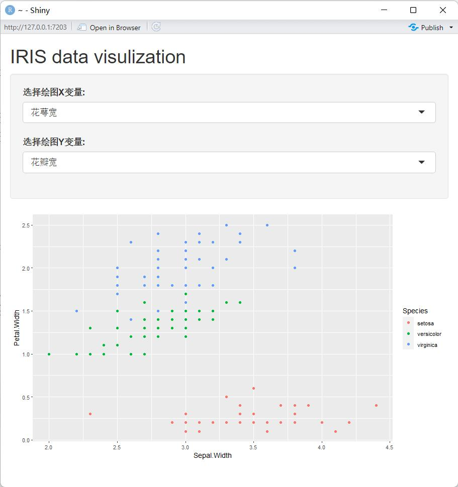
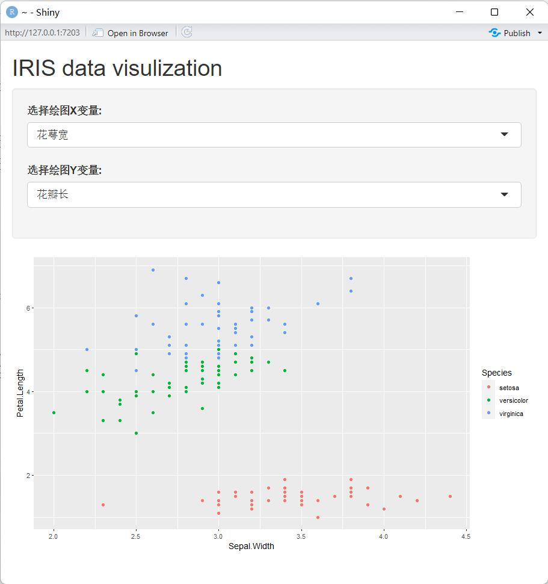
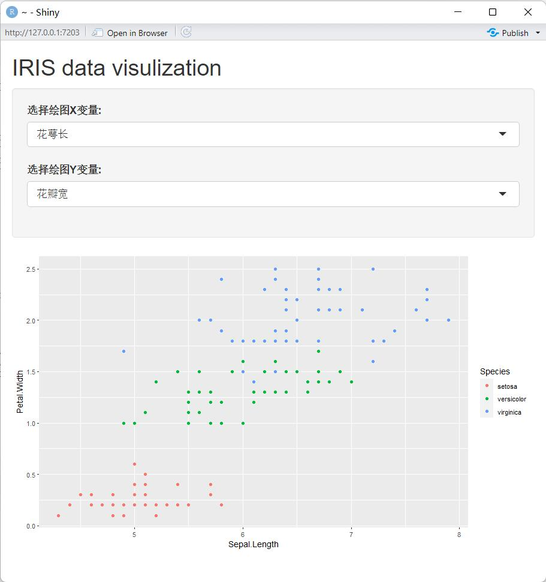
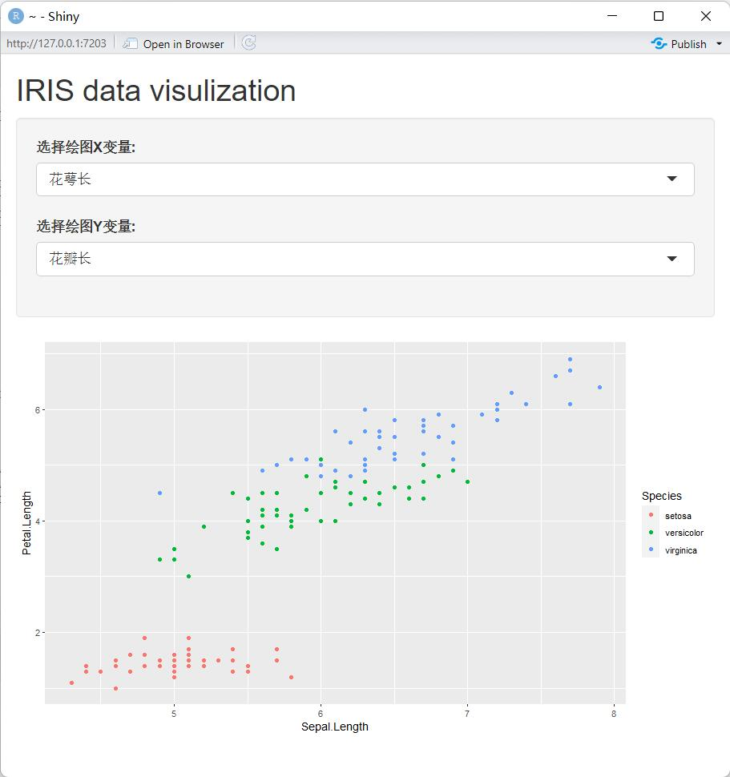
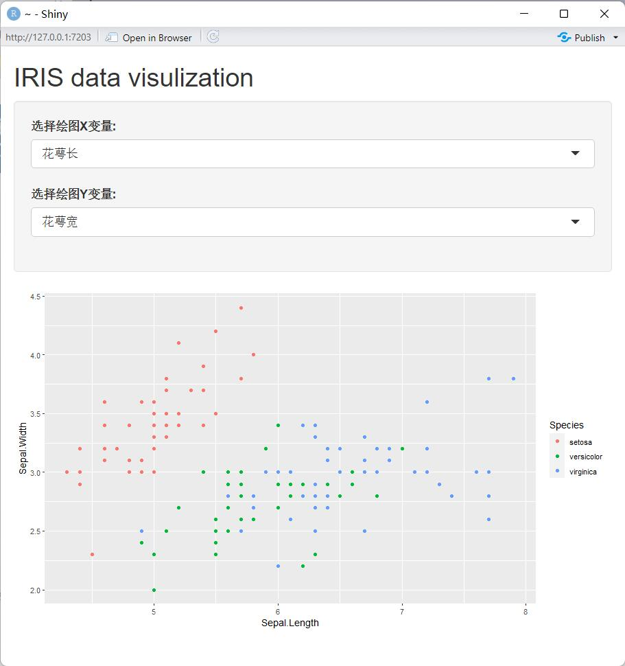

```{R,echo=TRUE,eval=FALSE}
#
# This is a Shiny web application. You can run the application by clicking
# the 'Run App' button above.
#
# Find out more about building applications with Shiny here:
#
#    http://shiny.rstudio.com/
#

library(shiny)
library(ggplot2)

# Define UI for application that draws iris variables
ui <- fluidPage(
  
  # Application title
  titlePanel("IRIS data visulization"),
  
  # Sidebar with a slider input for number of bins 
  sidebarLayout(
    sidebarPanel(
      selectInput("variable.x",
                  "选择绘图X变量:",
                  c("花萼长" = "Sepal.Length",
                    "花萼宽" = "Sepal.Width",
                    "花瓣长" = "Petal.Length",
                    "花瓣宽" = "Petal.Width"
                  )),
      selectInput("variable.y",
                  "选择绘图Y变量:",
                  c("花萼长" = "Sepal.Length",
                    "花萼宽" = "Sepal.Width",
                    "花瓣长" = "Petal.Length",
                    "花瓣宽" = "Petal.Width"
                  ))
    ),
    
    # Show a plot 
    mainPanel(
      plotOutput("irisPlot")
    )
  )
)

# Define server logic required to draw scatter
server <- function(input, output) {
  
  output$irisPlot <- renderPlot({
    # x.position <- which(name)
    ggplot(iris,aes(x=UQ(rlang::sym(input$variable.x)),
                    y=UQ(rlang::sym(input$variable.y)),
                    color=Species))+geom_point()
  })
}

# Run the application 
shinyApp(ui = ui, server = server)

```






